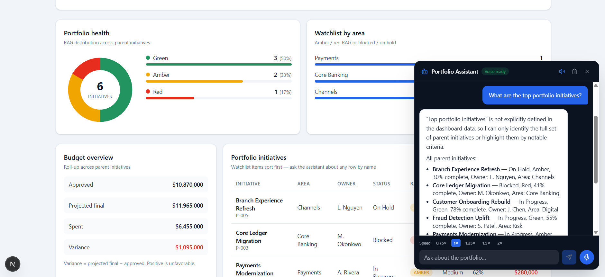

# Grounded AI Reference Architecture



> **Audience:** senior developers on delivery projects (financial services, life
> sciences, health, and adjacent sectors) who need a **runnable starter** for
> grounding conversational AI in an existing operational system — including
> teams that do not always use AI.

A reference implementation of how to integrate chat/voice into operational
software **without letting the LLM touch raw data**.

Business logic owns computation. Precomputed metrics own the numbers. The LLM
reasons over structured, version-stamped context and stays within a boundary it
can be held accountable to.

**Example domain:** synthetic project portfolio (PMO-style). The domain is
illustrative — swap it for claims, clinical trials, loan pipeline, ticket queue,
etc. without rewriting the AI or infra stack.

Standalone project. Synthetic seed data. No proprietary client logic.

---

## What this is / is not

| This **is** | This **is not** |
|---|---|
| A runnable reference for the grounded-context pattern | A full enterprise PMO product |
| A starter scaffold you can reshape for your sector | Production-hardened (no Entra/RBAC/CI yet) |
| Azure OpenAI + Speech + Bicep with one-command deploy | A RAG-over-documents demo |
| AI as an optional module on real APIs | An AI-first monolith |

If you only need the dashboard + services shape first, you can run without Azure
OpenAI or Speech (see [AI-optional path](#ai-optional-path)).

---

## The Pattern

```
Operational System  (ERP, CRM, core, LIMS, spreadsheet, …)
        │
        ▼
 Data Service Layer         SQLAlchemy + Alembic · seed_db.py
        │                   (in production: adapters to existing systems)
        ▼
 Business Logic Services    compute_overview() — deterministic Python, no LLM
        │
        ▼
 Grounded LLM Context       structured context + version stamp in system prompt
        │
        ▼
 Conversational Layer       LangGraph StateGraph + Azure OpenAI
        │
        ▼
 Chat + Voice Interface     Next.js · Azure Speech STT/TTS · server-side tokens
```

**Why this matters:** for operational UIs where users ask quantitative questions,
precomputed context beats retrieval-over-raw-rows (classic document RAG). Numbers
come from Python; the LLM only narrates them. Citations
(`Source: Dashboard data YYYY-MM-DD`) make the boundary visible.

> In the **UI**, “RAG” means **Red / Amber / Green** status — not
> Retrieval-Augmented Generation. See [`ARCHITECTURE.md`](./ARCHITECTURE.md)
> for context-size guidance when adapting beyond a small demo portfolio.

Architecture notes: [`ARCHITECTURE.md`](./ARCHITECTURE.md)

---

## Change these / leave these alone

When adapting to your sector, touch the left column. Leave the right column
unless you are changing platform choices.

| **Change (domain)** | **Leave alone (platform)** |
|---|---|
| `backend/app/models/` | `backend/app/services/voice_chat/graph.py` |
| `backend/alembic/versions/` | `backend/app/services/speech.py` + `/api/speech` |
| `backend/scripts/seed_db.py` | `infra/` Bicep + `deploy.ps1` / `cleanup.ps1` |
| `backend/app/services/dashboard.py` (`compute_overview`) | LangGraph checkpointer + chat route contract |
| `backend/app/services/voice_chat/context.py` (prompt + context shape) | Server-side Speech token exchange |
| Overview UI copy / columns in `frontend/src/components/dashboard/` | Floating voice panel wiring pattern |
| System prompt domain wording in `voice_chat/graph.py` | Design-token approach (`--ra-*` in `globals.css`) |

**Typical swap time for a senior who knows the target domain:** replace schema +
seed + `compute_overview` + context/prompt strings; keep chat, speech, and infra.

---

## Stack

| Layer | Choice |
|---|---|
| API | FastAPI + Uvicorn |
| Database | SQLite (dev) / Postgres-ready via Alembic |
| Orchestration | LangGraph + Azure OpenAI |
| Voice | Azure Speech Services (STT + Neural TTS) |
| Frontend | Next.js 16 + React 19 + Tailwind 4 |
| Infra | Azure Bicep (`infra/`) |
| Backend pkgs | uv |
| Frontend pkgs | pnpm |

---

## Prerequisites

| Tool | Purpose |
|---|---|
| Python 3.12+ | Backend |
| [uv](https://github.com/astral-sh/uv) | Python package manager |
| Node.js 20+ | Frontend |
| [pnpm](https://pnpm.io) | Frontend package manager |
| Azure CLI | `.\infra\deploy.ps1` (optional if you already have keys) |

---

## Quick Start

```bash
# 1. Clone
git clone https://github.com/mattdavida/grounded-ai-reference-architecture.git
cd grounded-ai-reference-architecture

# 2. Provision Azure resources (OpenAI + Speech + Key Vault)
#    Writes backend/.env automatically when done
.\infra\deploy.ps1

#    Already have an F0 Speech resource on the subscription? Skip Speech:
#    .\infra\deploy.ps1 -SkipSpeech
#    Then set AZURE_SPEECH_API_KEY in backend/.env from the existing resource.

# 3. Or configure manually
cp backend/.env.example backend/.env
# paste Azure values

# 4. Backend
cd backend
uv sync
uv run alembic upgrade head
uv run python scripts/seed_db.py
uv run uvicorn app.main:app --reload --port 8000

# 5. Frontend (new terminal)
cd frontend
pnpm install
pnpm dev   # -> http://localhost:4001
```

**Verify**

| Check | Expect |
|---|---|
| `GET http://localhost:8000/api/health` | `{"status":"ok","database":"ok","speech":"ok"}` (speech may be `unconfigured`) |
| `GET http://localhost:8000/api/dashboard/overview` | KPIs over 6 seeded projects |
| `POST http://localhost:8000/api/chat` `{"message":"What is our budget variance?"}` | Cited answer with `Source: …` |
| Browser `http://localhost:4001` | Overview + floating Portfolio Assistant |

---

## AI-optional path

You can evaluate the **service + UI skeleton** without calling models:

1. Skip `deploy.ps1` (or leave OpenAI/Speech keys empty in `backend/.env`).
2. Start backend + frontend as above.
3. Overview and `/api/projects` work from SQLite seed data.
4. `/api/chat` returns **503** until Azure OpenAI is configured.
5. Voice panel shows without “Voice ready” until Speech is configured.

Add AI when you are ready — the grounded-context path is already wired.

---

## Project layout

```
backend/          FastAPI, business logic, LangGraph chat, Speech token
frontend/         Next.js Overview dashboard + voice assistant
infra/            Azure Bicep (OpenAI, Speech, Key Vault, optional App Service)
ARCHITECTURE.md   Boundaries, request flows, adaptation contract
```

---

## Adapting to your domain (checklist)

1. Update `backend/app/models/` for your entities  
2. Add/adjust Alembic migrations  
3. Replace `backend/scripts/seed_db.py` with synthetic (or anonymized) data  
4. Replace `compute_overview()` in `backend/app/services/dashboard.py`  
5. Update context formatting + domain wording in `voice_chat/context.py` / `graph.py`  
6. Adjust Overview table/KPI labels in `frontend/src/components/dashboard/`  
7. Leave LangGraph topology, Speech token route, and Bicep modules as-is  

Details: [`ARCHITECTURE.md`](./ARCHITECTURE.md)

---

## Current status (pattern v1)

| Capability | Status |
|---|---|
| Grounded LangGraph chat + citations | Done |
| Azure Speech STT/TTS + server-side tokens | Done |
| Overview UI (KPIs, Red/Amber/Green donut, budget, table) | Done |
| Synthetic seed + Alembic | Done |
| Bicep deploy (`-SkipSpeech` supported) | Done |
| Agent tools scaffold (not bound) | Scaffold only |
| Entra ID / RBAC / CI / Postgres profile | Not yet |
| Extra dashboard tabs (detail, capacity, export) | Not yet |

Pattern v1 is a **vertical slice**: enough to run, demo, and adapt.

### Natural next steps (optional)

- KPI / Red-Amber-Green click-through filters and project detail view  
- Cap or filter LLM context for large entity sets (see ARCHITECTURE.md)  

- Entra ID + RBAC  
- Postgres profile + CI  
- Bind agent tools / streaming responses  

---
